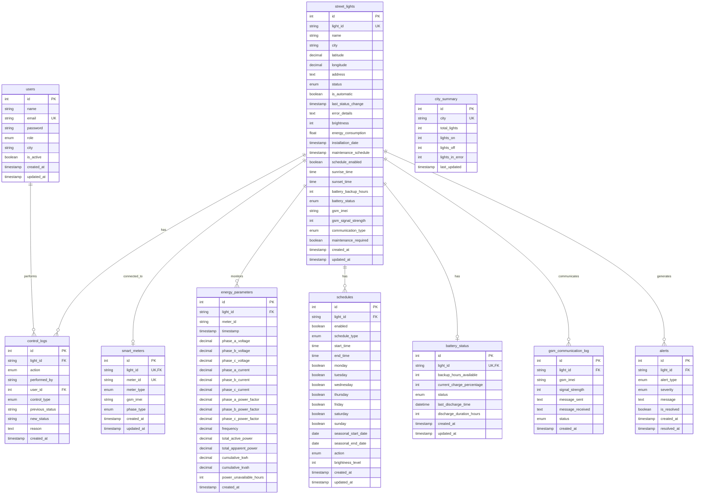

# Street Light Control System - Database ER Diagram

## Entity Relationship Diagram



## Table Cardinality Legend

| Relationship | Cardinality | Description |
|-------------|-------------|-------------|
| users → control_logs | 1:N | One user can perform many control actions |
| street_lights → control_logs | 1:N | One light can have many control log entries |
| street_lights → smart_meters | 1:1 | One light has one smart meter (optional) |
| street_lights → energy_parameters | 1:N | One light has many energy readings over time |
| street_lights → schedules | 1:N | One light can have multiple schedules |
| street_lights → battery_status | 1:1 | One light has one battery status record |
| street_lights → gsm_communication_log | 1:N | One light has many communication logs |
| street_lights → alerts | 1:N | One light can generate many alerts |

## Key Relationships Explained

### Primary Relationships
- **`street_lights`** is the central hub table - all CCMS tables reference it via `light_id`
- **`users`** links to `control_logs` to track who performed manual actions
- **`city_summary`** is independent (no FK) - aggregated data for dashboard performance

### Data Integrity
- All foreign keys use `ON DELETE CASCADE` except:
  - `control_logs.user_id` uses `ON DELETE SET NULL` (preserve logs even if user deleted)
- Unique constraints ensure:
  - One meter per light (`smart_meters.light_id` unique)
  - One battery record per light (`battery_status.light_id` unique)
  - No duplicate light IDs (`street_lights.light_id` unique)

### Indexes
- Performance indexes on:
  - All foreign key columns
  - `city` columns (for filtering)
  - `created_at` timestamps (for time-based queries)
  - GPS coordinates (`latitude`, `longitude` composite index)

## Database Size Estimation

Assuming 10,000 street lights with 1 year of data:

| Table | Records | Est. Size |
|-------|---------|-----------|
| users | 100-500 | < 1 MB |
| street_lights | 10,000 | ~2 MB |
| control_logs | ~3.65M | ~500 MB |
| city_summary | 10-100 | < 1 MB |
| smart_meters | 10,000 | ~1 MB |
| energy_parameters | ~87.6M | ~15 GB |
| schedules | 10,000-30,000 | ~5 MB |
| battery_status | 10,000 | ~1 MB |
| gsm_communication_log | ~3.65M | ~800 MB |
| alerts | ~365K | ~100 MB |
| **TOTAL** | | **~17 GB/year** |

*Assumptions: 1 energy reading/15min (96/day), 1 control action/day, 100 alerts/day*

## Performance Recommendations

1. **Partitioning**:
   - Partition `energy_parameters` by month (most data-heavy)
   - Partition `control_logs` by quarter
   - Partition `gsm_communication_log` by month

2. **Archival Strategy**:
   - Archive `energy_parameters` older than 6 months to cold storage
   - Keep `control_logs` for 2 years, then archive
   - Retain `alerts` indefinitely (small size)

3. **Indexing**:
   - Add composite index on `energy_parameters(light_id, timestamp)` for time-series queries
   - Add index on `alerts(is_resolved, severity)` for dashboard filters

4. **Materialized Views**:
   - Create hourly/daily aggregate views for `energy_parameters`
   - Pre-calculate common report queries

## Query Examples

### Get Light Status with Battery and Meter
```sql
SELECT 
    sl.light_id,
    sl.name,
    sl.status,
    bs.current_charge_percentage,
    sm.meter_id,
    ep.total_active_power
FROM street_lights sl
LEFT JOIN battery_status bs ON sl.light_id = bs.light_id
LEFT JOIN smart_meters sm ON sl.light_id = sm.light_id
LEFT JOIN energy_parameters ep ON sl.light_id = ep.light_id
WHERE sl.city = 'Delhi'
ORDER BY ep.timestamp DESC
LIMIT 1;
```

### Get Unresolved Critical Alerts
```sql
SELECT 
    a.light_id,
    sl.name,
    a.alert_type,
    a.message,
    a.created_at
FROM alerts a
JOIN street_lights sl ON a.light_id = sl.light_id
WHERE a.is_resolved = FALSE
  AND a.severity = 'critical'
ORDER BY a.created_at DESC;
```

### Daily Energy Consumption by City
```sql
SELECT 
    sl.city,
    DATE(ep.created_at) as date,
    SUM(ep.total_active_power) as total_kwh,
    COUNT(DISTINCT ep.light_id) as lights_reporting
FROM energy_parameters ep
JOIN street_lights sl ON ep.light_id = sl.light_id
WHERE ep.created_at >= DATE_SUB(NOW(), INTERVAL 7 DAY)
GROUP BY sl.city, DATE(ep.created_at)
ORDER BY date DESC, total_kwh DESC;
```
